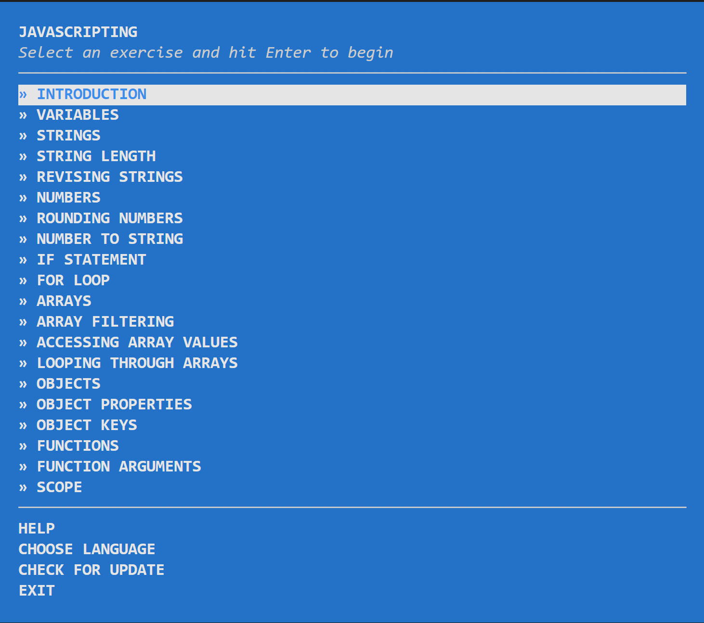

# JAVASCRIPTING

> Aprende JavaScript con aventuras en la terminal.

> _¿Buscas mas tutoriales interactivos como estos? Visita [nodeschool.io](http://nodeschool.io)._

## Obtén ayuda
¿Tienes problemas con javascripting? Obtén ayuda para la resolución de problemas en el [repo de discusiones nodeschool](https://github.com/nodeschool/discussions),
en [gitter](https://gitter.im/nodeschool/discussions) o en [repository issues](https://github.com/workshopper/javascripting/issues)

Ademas, echa un vistazo a nuestra [documentación de solución de problemas](https://github.com/workshopper/javascripting/blob/master/TROUBLESHOOTING.md)

## Instala Node.js

Asegurate que Node.js está instalado en tu computadora.

Instala esto desde [nodejs.org](https://nodejs.org/)

### Instala `javascripting` con `npm`

Abre tu terminal y ejecuta este comando:

```
npm install -g javascripting
```

La opción `-g` instala este modulo globalmente para que puedas ejecutarlo como un comando en tu terminal.

## Ejecuta el workshop

Abre tu terminal y ejecuta el siguiente comando:

```
javascripting
```

Verás el menú:



Naviga por el menu con las flechas de arriba & abajo. 

Escoge un reto al presionar enter.

### Echa un vistazo a este gif que muestra el primer desafío:


En el gif yo estoy usando el editor de linea de comandos `nano` ([aquí hay algunos consejos básicos de uso para nano](https://github.com/sethvincent/dev-envs-book/blob/master/chapters/05-editors.md#nano)).  

Tu puedes usar cualquier editor que tu prefieras.

[atom](http://atom.io) o [vs code](https://code.visualstudio.com/) son ambas buenas opciones.

## ¿Necesitas ayuda con algún ejercicio?

Abre un issue en el [nodeschool/discussions repo](https://github.com/nodeschool/discussions)

Incluye el nombre `javascripting` y el nombre de el reto en el que estas trabajando en el titulo del issue.

## Involúcrate

¡Bienvenidas las contribuciones de codigo! Por favor revisa la [documentacion en contribuciones](https://github.com/workshopper/javascripting/blob/master/CONTRIBUTING.md) para iniciar.

## License

MIT
